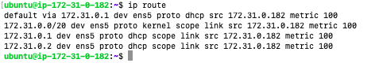
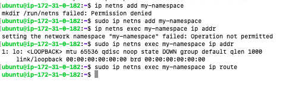

# Container Networking Fundamentals: A From-Scratch Guide

This repository explores the foundational concepts of container networking, starting from the building blocks provided by the Linux kernel. This guide is structured to be used as a basis for a tech talk, building from the ground up.

## The Starting Point: The Default Network Namespace

Every Linux system, including a fresh Ubuntu server, starts with a single, **default network namespace**. This is often called the "root" namespace. It's the environment you're in when you first SSH into the machine.

This default namespace contains all the physical and logical networking components that the host uses to communicate with the outside world.

### What's Inside the Default Namespace?

On a typical Ubuntu system, you will find:

1.  **A Loopback Interface (`lo`):** The standard `localhost` interface for local communication, available at `127.0.0.1`.

2.  **A Primary Network Interface (e.g., `eth0`):** This is the physical or virtual network card that connects your server to the wider network. It has an IP address assigned to it, allowing it to send and receive traffic.

3.  **A Complete Routing Table:** The host's routing table contains rules that direct traffic. At a minimum, it will have routes for the local subnet and a default gateway to route traffic to the internet.

You can inspect these using standard commands:
```bash
# View all interfaces and their IP addresses
ip addr

```

```bash

# View the host's routing table
ip route
```

---

## Creating Isolation: A New Network Namespace

The magic of containerization begins when we create a **new, isolated network namespace**. This gives a process (like a container) its own private copy of the network stack.

You can manually create one with the command:
```bash
# Create a new network namespace called 'my-namespace'
ip netns add my-namespace
```

### What's Inside a NEW Namespace? (The "Before" Picture)

This new namespace is **deliberately minimal** to ensure isolation. In contrast to the host's default namespace, it contains:

1.  **Only a Loopback Interface (`lo`):** It gets its own private loopback interface, but that's it! It has no `eth0` and no connection to the outside world.

2.  **An Empty Routing Table:** The routing table is nearly empty. It only knows about its own loopback device. It has no default gateway and no knowledge of any external networks.

This means a process inside `my-namespace` is completely isolated. It can't talk to the host, the internet, or any other namespace.

```bash
# To inspect the (very minimal) interfaces in the new namespace
ip netns exec my-namespace ip addr

# To inspect the (very empty) routing table
ip netns exec my-namespace ip route
```

---

## Building the Bridge: How Containers Communicate

If every container is in its own isolated namespace, how do they communicate?

We create a **virtual Ethernet pair (veth pair)**, which acts like a virtual patch cable.

*   **Step 1:** Create a `veth` pair.
*   **Step 2:** Move one end of the "cable" into the container's namespace (this becomes its `eth0`).
*   **Step 3:** Keep the other end in the host's default namespace and attach it to a **virtual bridge** (e.g., `docker0`).

The bridge acts as a virtual switch. All containers connected to it can now talk to each other. For the containers to talk to the internet, we add an IP address to the bridge and create a firewall rule (`iptables`) on the host to "masquerade" (or NAT) the traffic from the containers.

---

## Assignments Summary

This repository contains a series of assignments that build upon the concepts of container networking, from the fundamentals of network namespaces to advanced topics like network segmentation and load balancing.

### Assignment 1: The Basics

This assignment focuses on the fundamentals of network namespaces and virtual network interfaces. You'll learn how to:

*   Create and manage network namespaces.
*   Create a virtual bridge and connect namespaces to it using `veth` pairs.
*   Configure IP addresses and routing within namespaces.
*   Enable internet access for namespaces using `iptables` and NAT.

### Assignment 2: Running Services

This assignment builds on the first by running a multi-service application within the network namespaces. You'll learn how to:

*   Run a simple web server (Nginx) in a namespace.
*   Run a Python Flask application (API gateway) in a namespace.
*   Run a database (Redis) in a namespace.
*   Enable communication between the services.

### Assignment 3: Monitoring and Debugging

This assignment focuses on the tools and techniques used to monitor and debug a containerized network. You'll learn how to:

*   Use `tcpdump` to capture and analyze network traffic.
*   Use `ss` and `conntrack` to inspect connections.
*   Create a simple health monitoring script.

### Assignment 4: Advanced Networking

This assignment introduces more advanced networking concepts, including service discovery, load balancing, and network security policies. It's split into two parts:

*   **Part A:** Enhancing the original flat network with a service registry and `iptables` security policies.
*   **Part B:** Building a new, segmented architecture with separate networks for the frontend, backend, and database tiers, and implementing round-robin load balancing for the product service.

### Assignment 5: Docker Migration and Optimization

This assignment focuses on migrating the application from a manual setup to Docker. You'll learn how to:

*   Containerize the services using Dockerfiles.
*   Use Docker Compose to manage the application stack.
*   Benchmark the performance of the Dockerized application.

### Assignment 6: Multi-Host Networking

This assignment introduces multi-host networking with Docker Swarm. You'll learn how to:

*   Create a Docker Swarm cluster.
*   Use overlay networks to enable communication between containers on different hosts.
*   Deploy a distributed application to the swarm.

### Assignment 7: Documentation and Presentation

This assignment focuses on documenting the entire project and preparing a presentation.

### Bonus Assignments

The bonus assignments cover a range of advanced topics, including:

*   Service mesh with Envoy.
*   Distributed tracing with Jaeger.
*   Chaos engineering.
*   Auto-scaling.
*   CI/CD pipelines.