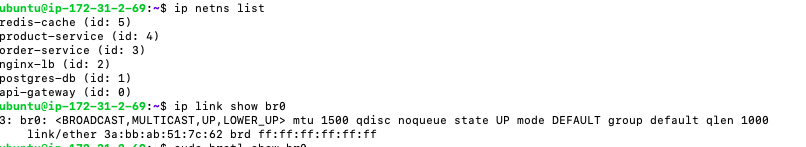
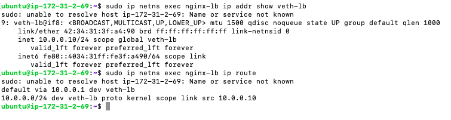
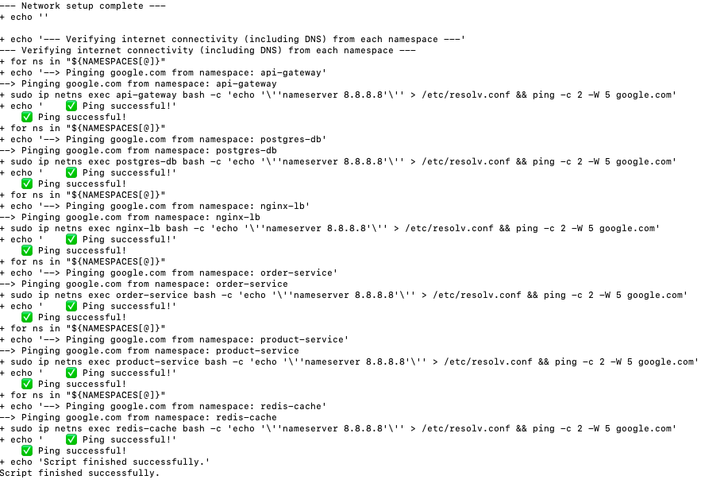

# Assignment 1: Foundation - Linux Primitives

This document details the setup of the foundational network infrastructure for the project. It outlines the original plan, the actual implementation, and the reasons for the changes.

## 1. Original Plan

The initial plan, as described in `week-long-project.md`, was to create a virtual network of six microservices using Linux network namespaces. The key components of the planned setup were:

*   **Network Namespaces:** One for each of the six services.
*   **Virtual Bridge:** A single bridge named `br-app` to connect all namespaces.
*   **IP Addressing:** A `/16` subnet (`10.0.0.0/16`) for all services.
*   **Connectivity:** `veth` pairs to connect each namespace to the bridge.
*   **Internet Access:** A `MASQUERADE` rule in `iptables` to provide internet access.
*   **Port Forwarding:** A `DNAT` rule to expose the `nginx-lb` service.

## 2. Actual Implementation

The final implementation, captured in the `assignment1.sh` script, improved upon the original plan in several ways:

*   **Idempotency:** The script includes a `cleanup` function that removes all created resources before setting them up again. This ensures that the script can be run multiple times without errors.
*   **Dynamic Interface Detection:** The script automatically detects the host's primary network interface, making the NAT rule more portable.
*   **Robust Network Configuration:** The script includes necessary `iptables` `FORWARD` rules to allow traffic to flow through the bridge.
*   **DNS Resolution:** The script explicitly configures DNS for each namespace, enabling internet access by domain name.

## 3. Key Changes and Justifications

Several key changes were made from the original plan to the final implementation:

| Feature         | Original Plan                               | Actual Implementation                                                               | Justification                                                                                                                              |
| --------------- | ------------------------------------------- | ----------------------------------------------------------------------------------- | ------------------------------------------------------------------------------------------------------------------------------------------ |
| **Bridge Name**     | `br-app`                                    | `br0`                                                                               | A minor change for brevity and convention.                                                                                                 |
| **Subnet Size**     | `/16` (65,534 IPs)                          | `/24` (254 IPs)                                                                     | A `/24` subnet is more appropriately sized for the number of services, which is a better networking practice.                            |
| **Veth Names**      | Long, descriptive names (e.g., `veth-nginx`) | Short, abbreviated names (e.g., `veth-lb`)                                           | This was a critical fix. Linux interface names are limited to 15 characters, and the original names would have caused the script to fail. |
| **DNS**             | Not addressed                               | A temporary `resolv.conf` with a public DNS server (`8.8.8.8`) is created for each namespace. | This is necessary for services to resolve public domain names.                                                                         |
| **Script Design**   | A series of manual commands                 | An idempotent shell script with `cleanup` and `setup` functions.                      | This makes the environment much easier to manage, create, and destroy, which is essential for development and testing.                |
| **Port Forwarding** | Included in the plan                        | Not implemented in the script                                                       | This feature was likely deferred to a later assignment to focus on the core network setup first.                                         |

## 4. Implemented Steps

The `assignment1.sh` script performs the following actions:

 namespace:** Assigns an IP address and a default route.
7.  **Adds `iptables` rules:** Creates a `MASQUERADE` rule for NAT and `FORWARD` rules for the bridge.
8.  **Verifies connectivity:** Pings `google.com` from each namespace to confirm internet access.

<!-- Image Placeholder: Namespace and Bridge Creation Output -->

<!-- Image Placeholder: IP and Route Configuration Output -->

<!-- Image Placeholder: Connectivity Verification Output -->

