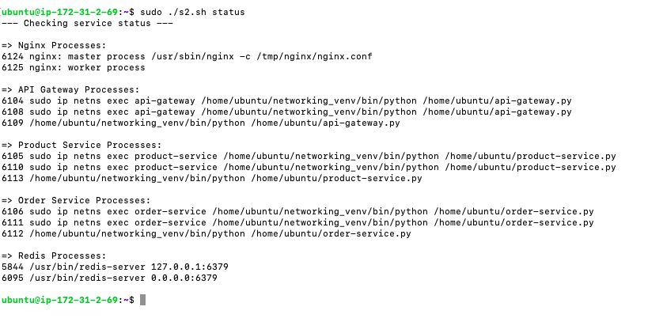
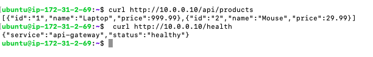

# Assignment 2: Application Services Deployment

This document describes the deployment of the microservices into the network infrastructure created in Assignment 1. It compares the original plan with the significantly more robust, automated implementation.

## 1. Original Plan

The original plan for Day 2 involved manually deploying each service into its respective network namespace. This included:

*   Creating configuration and source code files manually.
*   Running each service as a background process using `ip netns exec ... &`.
*   Assuming all host dependencies (like `nginx`, `python`, `pip`, `redis`, `postgres`) were pre-installed.
*   Hardcoding IP addresses directly into the application source code.
*   Lacking a clear strategy for managing the lifecycle (start, stop, status) of the services.
*   Providing an incomplete and "complex" path for setting up the PostgreSQL database.

This manual approach was fragile, not easily repeatable, and prone to race conditions and configuration errors.

## 2. Actual Implementation

The actual implementation, `assignment2.sh`, is a comprehensive, idempotent management script that automates the entire lifecycle of the application environment. This represents a major evolution from a manual checklist to an infrastructure-as-code-like approach.

The script provides the following commands:
*   `sudo ./assignment2.sh start`: Starts all services, ensuring a clean state.
*   `sudo ./assignment2.sh stop`: Stops all running service processes.
*   `sudo ./assignment2.sh restart`: Restarts all services.
*   `sudo ./assignment2.sh status`: Shows the status of all running processes.
*   `sudo ./assignment2.sh clean`: Removes all generated files and the Python virtual environment.

## 3. Key Changes and Justifications

The implementation introduced critical improvements over the original plan.

| Feature                      | Original Plan                                      | Actual Implementation                                                                                                                                                            | Justification                                                                                                                                                                       |
| ---------------------------- | -------------------------------------------------- | -------------------------------------------------------------------------------------------------------------------------------------------------------------------------------- | ----------------------------------------------------------------------------------------------------------------------------------------------------------------------------------- |
| **Deployment Strategy**      | Manual, one-by-one commands.                       | A single, automated, and idempotent script (`assignment2.sh`).                                                                                                                   | Automation ensures reliability, consistency, and ease of use. It transforms a manual process into a manageable, repeatable environment.                                           |
| **Dependency Management**    | Ignored (assumed to be pre-installed).             | Automatically installs system packages (`nginx`, `redis`, `postgresql`) via `apt-get` and manages Python packages in a dedicated virtual environment (`networking_venv`).        | This makes the project self-contained and portable. It's a best practice that avoids polluting the host system and ensures the correct package versions are used.                  |
| **Service Startup & Reliability** | Simple background processes (`&`).              | Robust startup logic that includes stopping old processes, waiting for dependencies (e.g., Redis), and redirecting output to log files for debugging.                              | This prevents common failures, such as services crashing because a database or cache isn't ready yet (a race condition), and makes the system significantly more stable.             |
| **PostgreSQL Setup**         | Vague and incomplete ("this is complex").          | Fully automated setup that configures PostgreSQL to accept network connections, updates the authentication rules (`pg_hba.conf`), and creates the `orders` database. | The script provides a complete, working solution for the database, which was a major gap in the original plan.                                                                    |
| **Configuration**            | Hardcoded IPs in source files.                     | Source and configuration files are generated by the script. Service URLs are sourced from environment variables, providing better flexibility.                               | This is a step towards the "Twelve-Factor App" methodology, where configuration is separated from code. It makes the services more adaptable to different environments.            |
| **Lifecycle Management**     | No commands to stop, restart, or check status.     | Clear `start`, `stop`, `restart`, `status`, and `clean` commands.                                                                                                                | This provides full control over the application stack, which is essential for development, testing, and operation.                                                                  |

## 4. Implemented Service Architecture

The script deploys the following services into their respective namespaces:

*   **`nginx-lb`**: An Nginx instance acts as a reverse proxy and load balancer, forwarding external traffic to the API Gateway.
*   **`api-gateway`**: A Flask application that serves as the single entry point for all API requests, routing them to the appropriate backend service.
*   **`product-service`**: A Flask application that manages product data and interacts with the Redis cache.
*   **`order-service`**: A Flask application that manages orders and interacts with the PostgreSQL database.
*   **`redis-cache`**: A Redis server for caching product data.
*   **`postgres-db`**: A PostgreSQL server for storing order data.

The script ensures that these services are started in the correct order and can communicate with each other over the virtual network.

<!-- Image Placeholder: Output of 'assignment2.sh start' command -->
<!-- Image for assignment2.sh start output would go here. e.g.  -->
<!-- Image Placeholder: Output of 'assignment2.sh status' command -->

<!-- Image Placeholder: Successful API request to the running services -->
