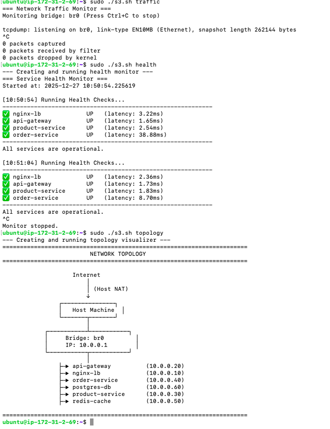

# Assignment 3: Monitoring and Debugging Toolkit

This document details the monitoring and debugging tools created to observe the health and performance of the deployed microservices. It highlights the evolution from a set of individual scripts to a unified, automated toolkit.

## 1. Original Plan

The original plan for Day 3 was to create four separate, standalone scripts for monitoring:

*   A shell script for capturing traffic with `tcpdump`.
*   A Python script for checking service health endpoints.
*   A shell script for tracking network connections with `conntrack` and `ss`.
*   A Python script for visualizing the network topology.

This plan required manual installation of all prerequisites (like `tcpdump`, `conntrack`, and Python libraries) and assumed the scripts would be run in a perfectly configured environment. The scripts themselves were basic and lacked robust error handling.

## 2. Actual Implementation

The final implementation consolidates all monitoring functions into a single, intelligent shell script: `assignment3.sh`. This script acts as a unified toolkit, providing a much cleaner and more powerful user experience.

The toolkit is invoked with a command specifying the desired tool:
*   `sudo ./assignment3.sh traffic`: Monitors raw network traffic on the bridge.
*   `sudo ./assignment3.sh health`: Runs a continuous health check against all service endpoints.
*   `sudo ./assignment3.sh connections`: Tracks active connections and their states.
*   `sudo ./assignment3.sh topology`: Generates and displays a text-based network diagram.

<!-- Image Placeholder: Architecture Diagram showing Monitoring Tools -->
<!-- A visual diagram or an output of the 'topology' command would go here. e.g.  -->

## 3. Key Changes and Justifications

The implemented toolkit is a significant improvement over the original set of scripts.

| Feature                 | Original Plan                                | Actual Implementation                                                                                                                                                              | Justification                                                                                                                                                                                             |
| ----------------------- | -------------------------------------------- | ---------------------------------------------------------------------------------------------------------------------------------------------------------------------------------- | --------------------------------------------------------------------------------------------------------------------------------------------------------------------------------------------------------- |
| **Script Organization** | Four separate, disconnected scripts.         | A single, unified toolkit (`assignment3.sh`) that accepts the desired tool as a command-line argument.                                                                           | This approach is much cleaner, easier to manage, and more user-friendly. It provides a single entry point for all monitoring tasks, creating a cohesive "monitoring dashboard" experience.           |
| **Dependency Management** | Manual installation of all prerequisites.    | **Automatic, on-demand prerequisite installation.** The script checks for required packages for the *specific tool being run* and installs them automatically using `apt-get` and `pip`. | This makes the toolkit highly portable and easy to use. The user doesn't need to worry about dependencies, as the script handles it for them, improving the setup experience and reducing errors. |
| **Code Structure**      | Static script files.                         | The core logic is in the main shell script. Python-based tools (`health`, `topology`) are dynamically generated as temporary files at runtime.                                      | This makes the entire toolkit self-contained in a single file (`assignment3.sh`), which simplifies distribution and management.                                                                 |
| **Robustness & Error Handling** | Minimal error checking.                | The tools are more robust. For example, the connection tracker and topology visualizer first check if the network namespaces exist before attempting to inspect them.                     | This prevents the scripts from failing with cryptic errors if the environment is not in the expected state, making the tools more reliable in practice.                                                   |
| **User Experience (UX)**| Basic command-line output.                   | The output is cleaner and more user-friendly, with clear headers, status symbols (✅/❌), and continuously updating views for the `health` and `connections` tools.              | A polished and informative interface makes the tools more effective and easier to interpret, which is critical for monitoring and debugging.                                                          |

## 4. Monitoring Tools Overview

The `assignment3.sh` script provides the following capabilities:

### a. Traffic Analysis (`traffic`)
Uses `tcpdump` to capture and display all network packets flowing across the `br0` bridge. This is invaluable for low-level debugging of service-to-service communication.

<!-- Image Placeholder: Output of the 'traffic' command -->
<!-- e.g.  -->

### b. Health Checker (`health`)
Runs a continuous loop that sends HTTP requests to the `/health` endpoint of each service. It reports the status (UP/DOWN) and response latency, providing a real-time dashboard of service availability.

<!-- Image Placeholder: Output of the 'health' command -->
<!-- e.g.  -->

### c. Connection Tracker (`connections`)
Provides a snapshot, updated every 5 seconds, of active network connections. It shows the number of established connections per namespace and a summary of connection states from the kernel's `conntrack` table.

<!-- Image Placeholder: Output of the 'connections' command -->

### d. Topology Visualizer (`topology`)
Inspects the system's network namespaces and their IP addresses to generate a clear, text-based diagram of the entire network architecture, from the host down to each individual service.

<!-- Image Placeholder: Output of the 'topology' command -->
