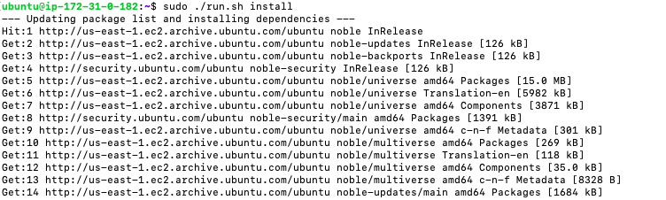
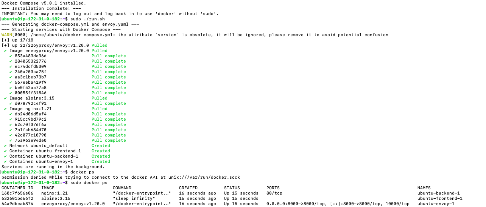
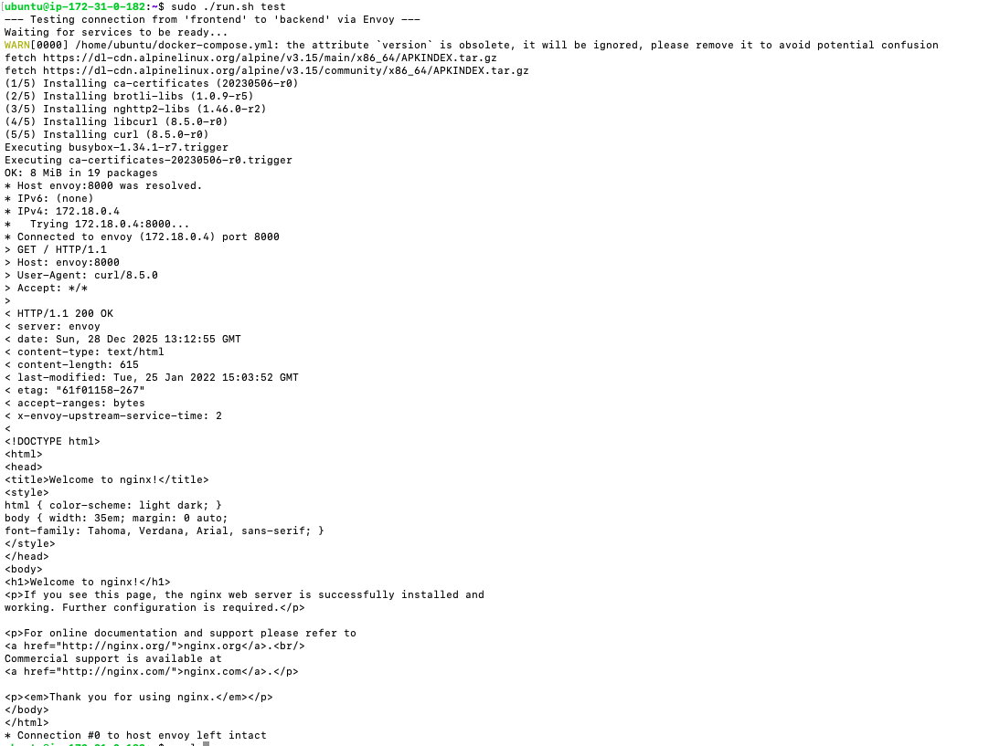
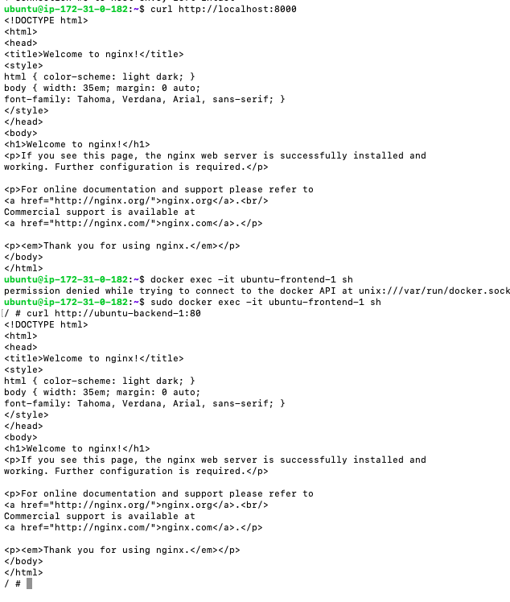
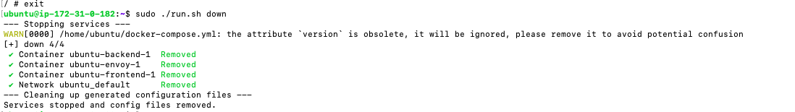

# Bonus 1: Implement a Simple Proxy with Envoy

This directory contains a minimal implementation of a centralized proxy pattern using Docker Compose and Envoy. This is a stepping stone to understanding a full service mesh.

## Components

1.  **`run.sh`**: The main script to manage the demo. It dynamically generates the necessary configuration files.
2.  **`docker-compose.yml` (generated by `run.sh`)**: Defines three services:
    - `frontend`: A simple `alpine` container that we will use to send a request.
    - `backend`: A standard `nginx` web server.
    - `envoy`: A central Envoy proxy.

3.  **`envoy.yaml` (generated by `run.sh`)**: A basic configuration for the Envoy proxy. It's configured to:
    - Listen for incoming traffic on port `8000`.
    - Route that traffic to the `backend` service on port `80`.

## How to Run (with `run.sh` script)

This directory includes a convenient script, `run.sh`, to automate setup and execution, especially on a fresh Ubuntu server (like an EC2 instance).

First, make the script executable:
```bash
chmod +x run.sh
```

### 1. Install Dependencies (First time on a new server)
This command will install Docker and Docker Compose.
```bash
./run.sh install
```
**Important:** After running the install command, you may need to log out and log back in for the `docker` group changes to take effect.

### 2. Start the Services
This command will build the images and start the services in the background.
```bash
./run.sh up
```
This is the default command, so you can also just run `./run.sh`.

### 3. Test the Connection
This command will execute a `curl` request from the `frontend` container to the `backend` via the `envoy` proxy to verify everything is working.
```bash
./run.sh test
```
You will see that the `envoy` service receives the request and proxies it to the `backend` service, returning the `nginx` welcome page. This demonstrates how a proxy can decouple service-to-service communication.

### 4. Stop the Services
When you are finished, you can stop and remove all the services and networks.
```bash
./run.sh down
```

## Key Concepts Demonstrated

- **Centralized Proxy:** A single proxy manages traffic routing between other services.
- **Service Discovery:** The Envoy proxy finds the `backend` service using Docker's internal DNS.
- **Decoupling:** The `frontend` does not need to know the direct address or port of the `backend`; it only needs to know about the proxy. This makes it easier to change or replace backend services without reconfiguring the frontend.






