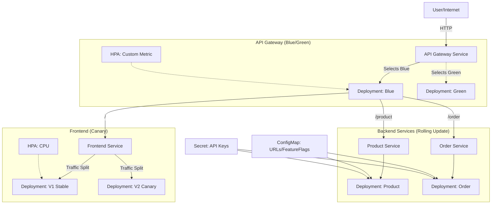

# Application Lifecycle Management - Architecture & Deployment Guide

## Architecture Diagram



## Deployment Guide

### Prerequisites
- Any Kubernetes Cluster (Killercoda, Minikube, EKS, GKE, etc.)
- `kubectl` configured

### Step 1: Deploy Manifests
You can deploy everything with a single command if you are in the root of the repo:

```bash
kubectl apply -f kube_lifecycle/manifests/common/
kubectl apply -f kube_lifecycle/manifests/product-service/
kubectl apply -f kube_lifecycle/manifests/order-service/
kubectl apply -f kube_lifecycle/manifests/frontend/
kubectl apply -f kube_lifecycle/manifests/api-gateway/
```

### Step 2: Verification
Run the verification script:
```bash
./kube_lifecycle/tests/verify.sh
```

### Step 3: Demo Scenarios

#### Canary Deployment (Frontend)
1. Edit `kube_lifecycle/manifests/frontend/frontend-deployment-v2.yaml` and increase replicas.
2. Observe traffic splitting between V1 (Blue/Purple theme) and V2 (Orange theme) by refreshing the page.

#### Blue-Green Deployment (API Gateway)
1. Deploy Green version: `kubectl apply -f kube_lifecycle/manifests/api-gateway/api-gateway-green.yaml`
2. Wait for readiness.
3. Switch traffic: Edit `kube_lifecycle/manifests/api-gateway/api-gateway-service.yaml` and change selector to `color: green`.
4. Apply: `kubectl apply -f kube_lifecycle/manifests/api-gateway/api-gateway-service.yaml`
5. Verify access via LoadBalancer IP.

#### Backend Rolling Update
1. Update image in `kube_lifecycle/manifests/product-service/product-deployment.yaml` (e.g., adding an annotation or changing a dummy var to trigger rollout if image stays same).
2. Apply changes.
3. Watch rollout: `kubectl rollout status deployment/product-service -n kube-lifecycle`
